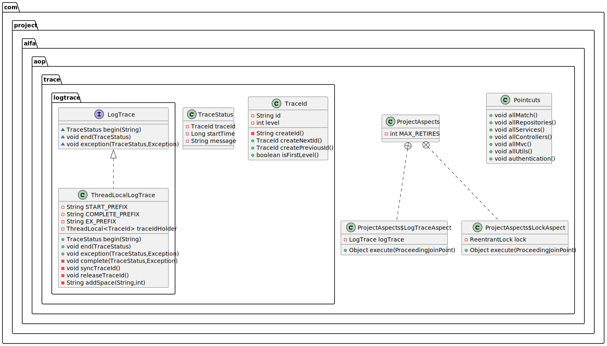
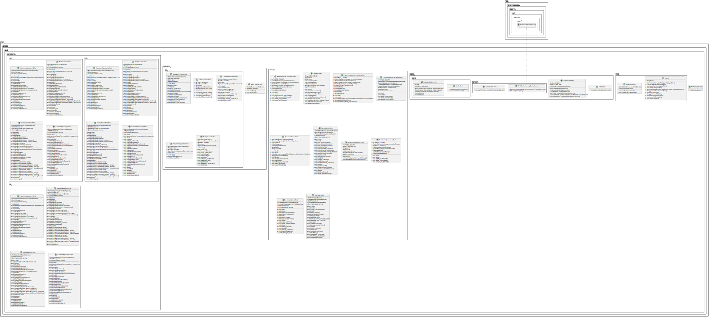

#### [ JPA 프로젝트 클래스 다이어그램 ]
- 사진 클릭 시 원본 조회 가능
- src/main
    - com.project.alfa.aop

    

    - com.project.alfa.config

    

    - com.project.alfa.controllers

    

    - com.project.alfa.entities

    

    - com.project.alfa.error

    

    - com.project.alfa.interceptor

    

    - com.project.alfa.repositories

    

    - com.project.alfa.security

    

    - com.project.alfa.services

    

    - com.project.alfa.utils

    

- src/test
    - com.project.alfa

    