#### [ MyBatis 프로젝트 클래스 다이어그램 ]
- 사진 클릭 시 원본 조회 가능
- src/main
    - com.project.alfa.aop

    <a href="./mybatis/assets/aop.svg" target="_blank">
        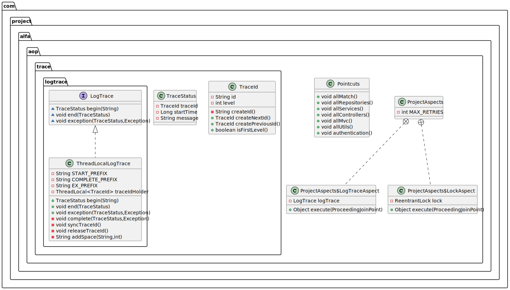
    </a>

    - com.project.alfa.config

    <a href="./mybatis/assets/config.svg" target="_blank">
        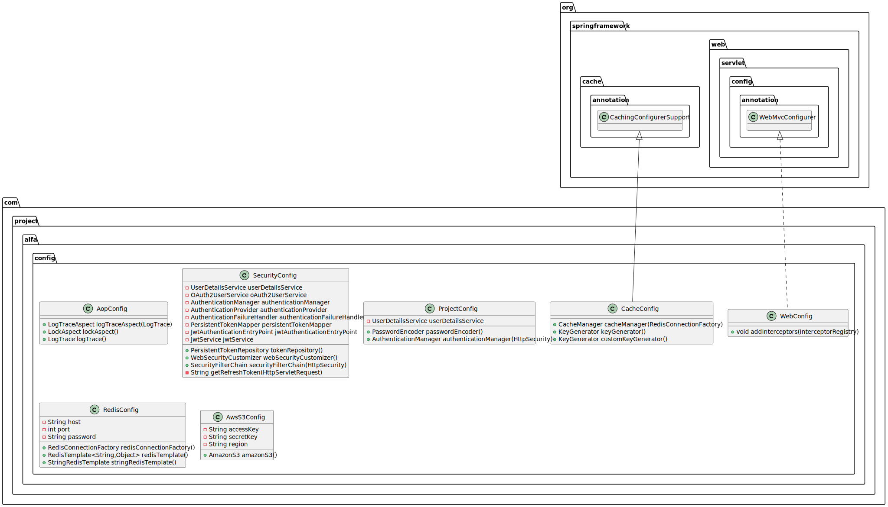
    </a>

    - com.project.alfa.controllers

    <a href="./mybatis/assets/controllers.svg" target="_blank">
        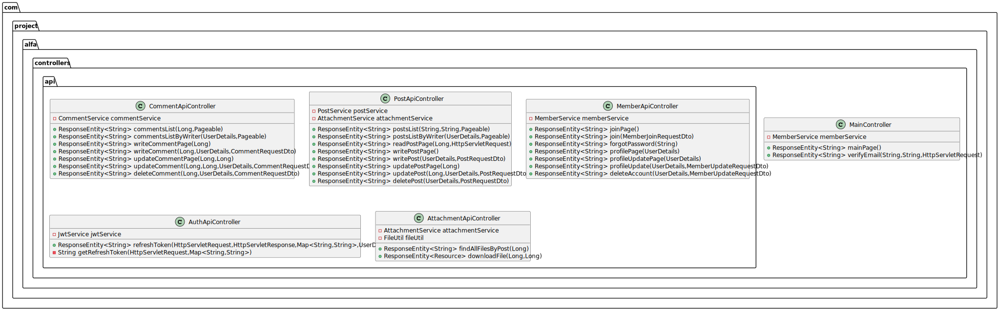
    </a>

    - com.project.alfa.entities

    <a href="./mybatis/assets/entities.svg" target="_blank">
        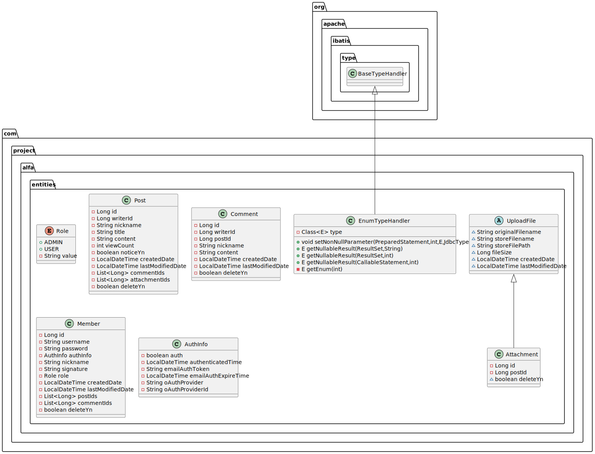
    </a>

    - com.project.alfa.error

    <a href="./mybatis/assets/error.svg" target="_blank">
        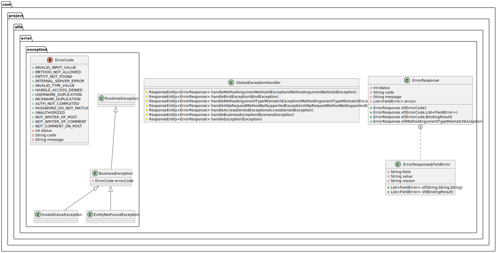
    </a>

    - com.project.alfa.interceptor

    <a href="./mybatis/assets/interceptor.svg" target="_blank">
        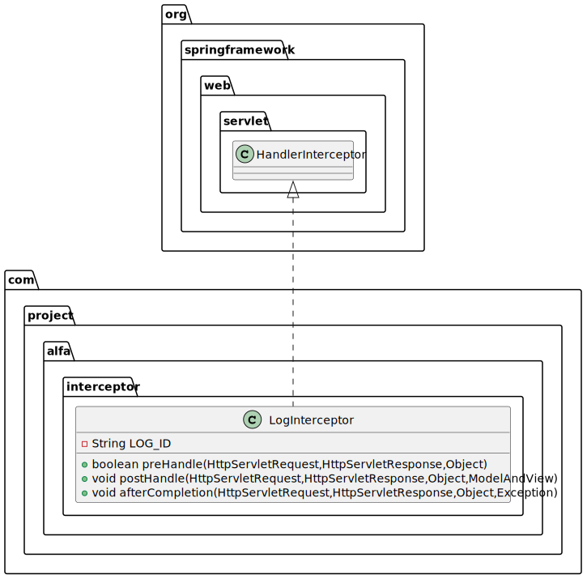
    </a>

    - com.project.alfa.repositories

    <a href="./mybatis/assets/repositories.svg" target="_blank">
        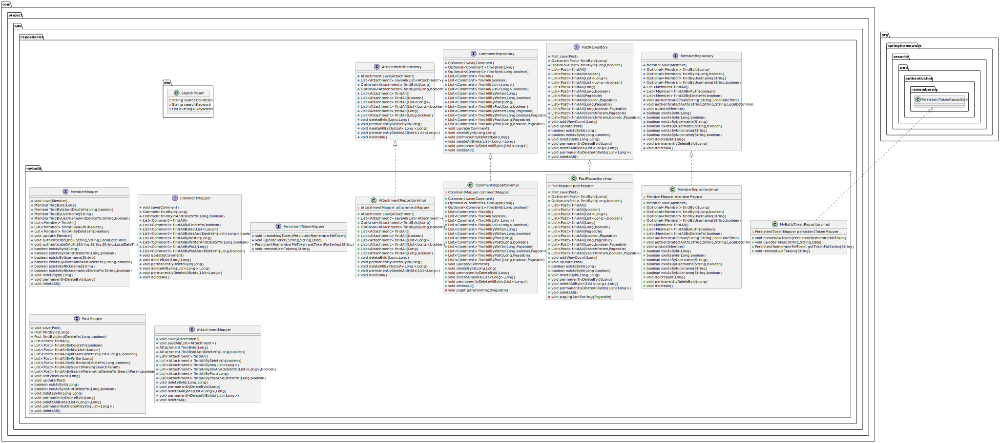
    </a>

    - com.project.alfa.security

    <a href="./mybatis/assets/security.svg" target="_blank">
        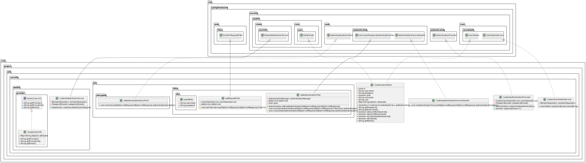
    </a>

    - com.project.alfa.services

    <a href="./mybatis/assets/services.svg" target="_blank">
        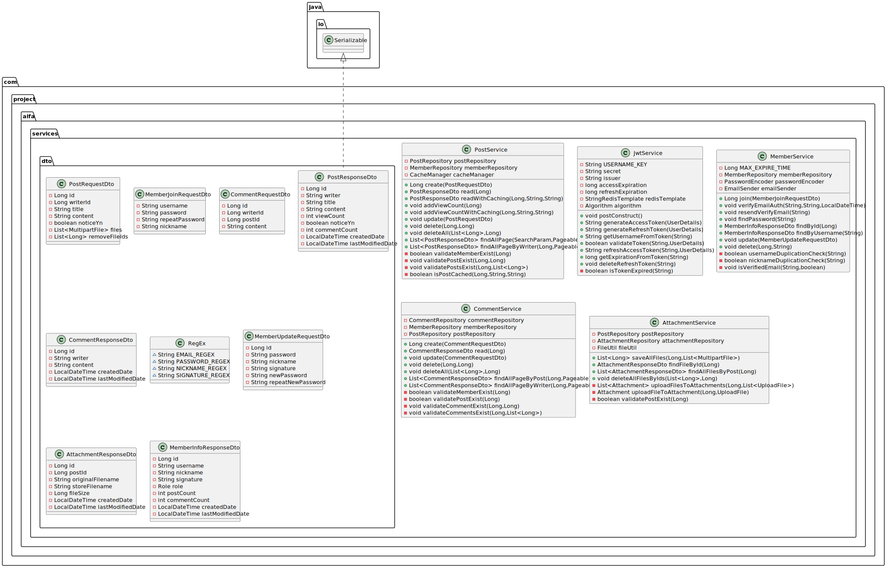
    </a>

    - com.project.alfa.utils

    <a href="./mybatis/assets/utils.svg" target="_blank">
        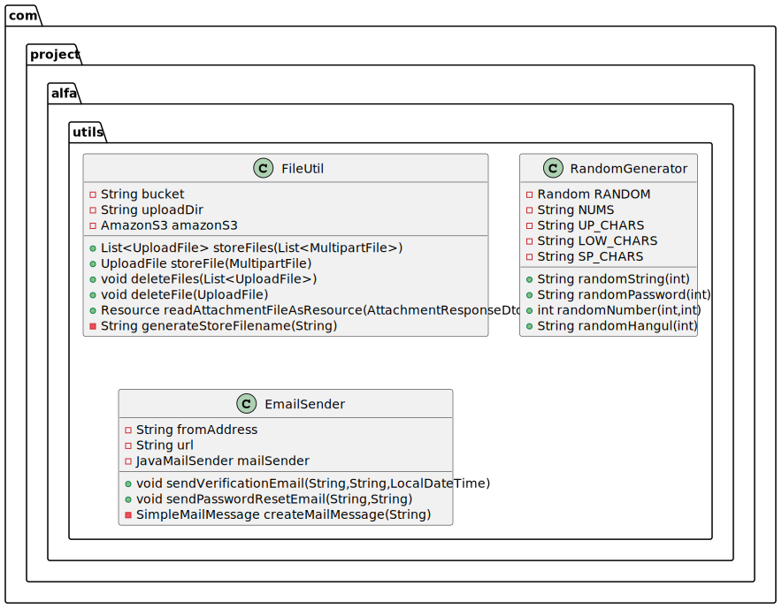
    </a>
- src/test
    - com.project.alfa

    <a href="./mybatis/assets/test.svg" target="_blank">
        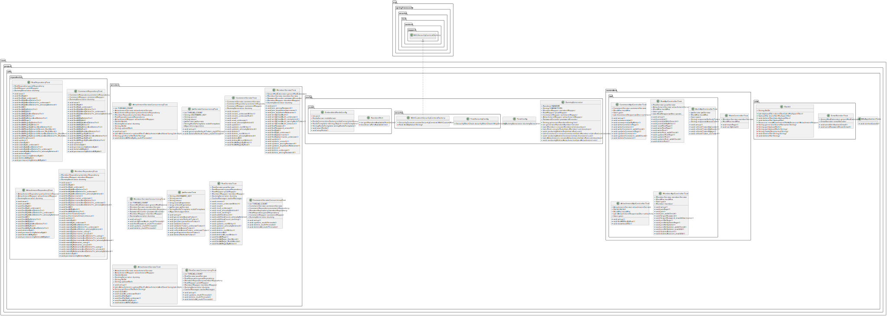
    </a>